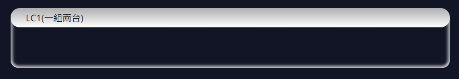
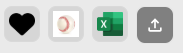
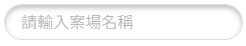
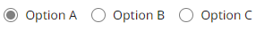
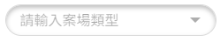
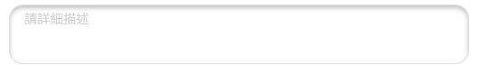
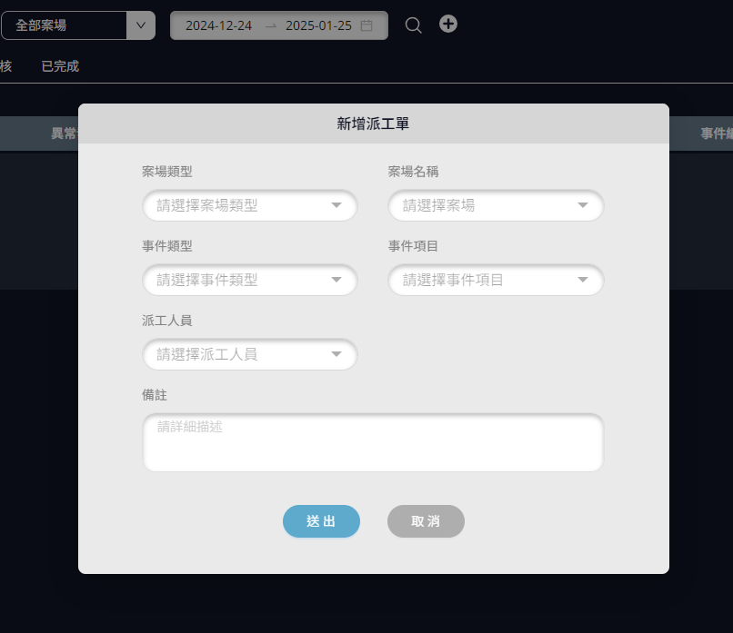
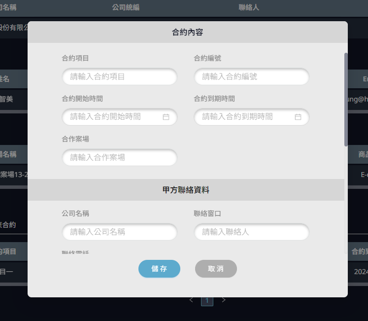

## Units (最小的元件)

### --- infoCircle

示意圖：


textColor 為紅色：


Props 參數：
| Name | Default | Type | Description |
| --------------- | ------- | --------- | ----------------------------------------------- |
| className | | string | 作用在 infoCircle 容器上的 class name |
| text | | sting | 圓圈內顯示的內容 |
| textColor | #78d6ec | string | 字體顏色預設為#78d6ec，非預設值時也會改變圓圈顏色 |
| title | | string | 下方標題名稱 |

Demo：

```jsx
<InfoCircle
  className="mg-b-24"
  text="正常"
  textColor="#ff0000"
  title="運轉狀態"
/>
```

### --- categoryBox

示意圖：


themeCategory 為 circle：


Props 參數：
| Name | Default | Type | Description |
| --------------- | -------- | --------- | ------------------------------------------------------ |
| background | | string | 作用在 body 的背景色，請填寫 css 屬性中的 background 樣式 |
| bodyClassName | | string | 作用在 body 的 class name |
| className | | string | 作用在 categoryBox 容器上的 class name |
| children | | reactNode | body 內要顯示的 HTML 或 JSX 節點，也可以輸入文字 |
| headerClassName | | string | 作用在 header 的 class name |
| headerTextAlign | "left" | string | 作用在 header 的文字對齊方式 |
| isShowBorder | true | boolean | 是否 body 要顯示 border |
| themeCategory | "normal" | string | 各式 theme 樣式<br/><b>Enums</b> :<br/>circle、normal |
| title | | string | header 標題名稱

Demo：

```jsx
<CategoryBox title="標題名稱">
  <div>Body Content</div>
</CategoryBox>
```

### --- imageUpload

示意圖：




Props 參數：
| Name | Secondary Name | Default | Type | Description |
| --------------------- | -------------- | ------------------ | ----------------- | ----------------------------------------------------------------------------------------------------------------------------------------------------------------------------------------------------------------------------------------------------------------------------------------------------------------------------------------------------------------------- |
| btnUpload | | (上傳圖片預設 Icon) | reactNode | 要替換上傳圖片按鈕的 HTML 或 JSX 節點，也可以輸入文字<br/><span style="color:#858585;">※ 需當參數 type 為 edit 時才有作用</span> |
| className | | | string | 作用在 imageUpload 容器上的 class name<br/><span style="color:#858585;"> |
| imageWidth | | 36 | number<br/>string | 調整上傳圖片後的列表，各個圖片寬度<br/><span style="color:#858585;">※ 型別為數字則預設單位為 px</span> |
| imageHeight | | 36 | number<br/>string | 調整上傳圖片後的列表，各個圖片高度<br/><span style="color:#858585;">※ 型別為數字則預設單位為 px</span> |
| imagePreviewGroupAttr | | | object | 屬性設定 [請參考 React Ant Design 的 Image.PreviewGroup 元件](https://ant.design/components/image-cn#previewgroup) <br/><span style="color:#858585;">※ 需當參數 type 為 read 時才有作用</span> |
| list | | | array | <span style="color:#858585;">※ 需當參數 type 為 read 時才有作用</span> |
| | imageAttr | | object | 屬性設定 [請參考 React Ant Design 的 Image 元件](https://ant.design/components/image-cn#api) |
| removeDisabledIndexs | | | array[number] | 上傳圖片後的列表中，可針對指定 index 禁用移除按鈕<br/><span style="color:#858585;">※ 需當參數 type 為 edit 時才有作用</span><br/><span style="color:#858585;">※ 若要對全部的圖片禁用，可使用屬性 uploadAttr.showUploadList.showRemoveIcon</span><br/><span style="color:#858585;">※ removeDisabledIndexs 屬性設定權限會大於屬性 uploadAttr.showUploadList.showRemoveIcon</span> |
| type | | "edit" | string | 閱讀模式還是編輯模式<br/><b>Enums</b> :<br/>read、edit |
| uploadAttr | | | object | 屬性設定 [請參考 React Ant Design 的 Upload 元件](https://ant.design/components/upload-cn#api) <br/><span style="color:#858585;">※ 需當參數 type 為 edit 時才有作用</span> |

Demo1 (read 模式)：

```jsx
<ImageUpload
  className="custom-imageupload-container"
  imageWidth={36}
  imageHeight={36}
  imagePreviewGroupAttr={{
    preview: {
      onChange: (current) => console.log(current),
    },
  }}
  list={[
    {
      imageAttr: {
        src: "https://today-obs.line-scdn.net/0ha4k4lbMEPhtWTSzX-gJBTG4bMmplKyQSdC55KnNOYywpYStJbiJteCMdYDcoKi5MdishKSdKZyJ9eH9Maw/w644",
      },
    },
    {
      imageAttr: {
        src: "https://www.apple.com/tw/iphone/home/images/overview/consider_modals/environment/modal_trade_in__k5xx81wg61ei_large.jpg",
      },
    },
  ]}
  type="read"
/>
```

Demo2 (edit 模式)：

```jsx
<ImageUpload
  className="custom-imageupload-container"
  imageWidth={36}
  imageHeight={36}
  removeDisabledIndexs={[0, 2]}
  uploadAttr={{
    fileList: [
      {
        url: "https://se-dev-backend.codingmaster.cc/media/order_images/apple_tgqkKrh.png",
      },
    ], //此設定可以在未上傳時代入預設圖片(等同於type為read的功能)
  }}
  type="edit"
/>
```

### --- input

示意圖：


Props 參數：

| Name         | Default | Type      | Description                                                                                                                            |
| ------------ | ------- | --------- | -------------------------------------------------------------------------------------------------------------------------------------- |
| className    |         | string    | 作用在 input 容器上的 class name<br/><span style="color:#858585;">※ 若要作用在 input 本身的 class name，請使用 inputAttr 的設定</span> |
| errorMessage |         | reactNode | 欄位驗證失敗時要顯示的 HTML 或 JSX 節點，也可以輸入文字                                                                                |
| inputAttr    |         | object    | 屬性設定 [請參考 React Ant Design 的 Input 元件](https://ant.design/components/input-cn#api)                                           |
| isInvalid    |         | boolean   | 欄位是否驗證失敗                                                                                                                       |

Demo：

```jsx
<Input
  className="custom-input-container"
  errorMessage="此欄位必填"
  inputAttr={{
    className: "input-element",
    placeholder: "輸入數值",
    onChange(e) {
      console.log(e.target.value);
    },
  }}
  isInvalid
/>
```

### --- pageBox

示意圖：


Props 參數：

| Name                  | Secondary Name | Default       | Type               | Description                                                                                                                                                |
| --------------------- | -------------- | ------------- | ------------------ | ---------------------------------------------------------------------------------------------------------------------------------------------------------- |
| backSetting           |                |               | object             | 上一頁按鈕相關設定                                                                                                                                         |
|                       | isVisible      | false         | boolean            | 上一頁按鈕是否顯示                                                                                                                                         |
|                       | onClick        |               | function           | 上一頁按紐點擊事件 function(){}                                                                                                                            |
| bgColorLinearGradient |                |               | boolean<br/>object | 背景漸層色設定<br/>※ 若型別為 bollean:false 則無背景色<br/>若型別為 boolean:true 則會使用 object 型別的預設樣式<br/>若型別為 object 則請看下欄 object 設定 |
|                       | direction      | "bottom"      | string             | 漸層方向                                                                                                                                                   |
|                       | endColor       | "transparent" | string             | 結尾漸層顏色                                                                                                                                               |
|                       | endRange       | "0"           | string             | 結尾漸層範圍                                                                                                                                               |
|                       | startColor     | "#38404e"     | string             | 起始漸層顏色                                                                                                                                               |
|                       | startRange     | "200px"       | string             | 起始漸層範圍                                                                                                                                               |
| className             |                |               | string             | 作用在 pagebox 容器上的 class name                                                                                                                         |
| children              |                |               | reactNode          | 容器內要顯示的 HTML 或 JSX 節點，也可以輸入文字                                                                                                            |
| headerTitle           |                |               | string             | 標題內容                                                                                                                                                   |
| headerStyle           |                |               | object             | 標題區塊的 css 樣式                                                                                                                                        |

Demo：

```jsx
<PageBox
  baseSetting={{
    isVisible: false,
    onClick: () => {
      console.log("click");
    },
  }}
  bgColorlinearGradient={{
    direction: "bottom",
    endColor: "transparent",
    endRange: "0",
    startColor: "#38404e",
    startRange: "200px",
  }}
  className="custom-page-box-container"
  headerTitle="企業管理 Business Management"
  headerStyle={{ width: "525px" }}
>
  <div>Content</div>
</PageBox>
```

### --- radio

示意圖：


Props 參數 (Radio)：

| Name         | Default | Type      | Description                                                                                                                            |
| ------------ | ------- | --------- | -------------------------------------------------------------------------------------------------------------------------------------- |
| className    |         | string    | 作用在 radio 容器上的 class name<br/><span style="color:#858585;">※ 若要作用在 radio 本身的 class name，請使用 radioAttr 的設定</span> |
| children     |         | reactNode | 要顯示的 HTML 或 JSX 節點，也可以輸入文字                                                                                              |
| errorMessage |         | reactNode | 欄位驗證失敗時要顯示的 HTML 或 JSX 節點，也可以輸入文字                                                                                |
| isInvalid    |         | boolean   | 欄位是否驗證失敗                                                                                                                       |
| radioAttr    |         | object    | 屬性設定 [請參考 React Ant Design 的 Radio 元件](https://ant.design/components/radio-cn#api)                                           |

Demo1：

```jsx
<Radio
  className="custom-radio-container"
  radioAttr={{
    disabled: true,
  }}
>
  是否同意
</Radio>
```

Demo2：

```jsx
<Radio isInvalid errorMessage="此欄位必填">
  是否同意
</Radio>
```

示意圖：


Props 參數 (Radio.Group)：

| Name           | Default | Type      | Description                                                                                                                                                                                                                                                                                                                                                           |
| -------------- | ------- | --------- | --------------------------------------------------------------------------------------------------------------------------------------------------------------------------------------------------------------------------------------------------------------------------------------------------------------------------------------------------------------------- |
| className      |         | string    | 作用在 radio.group 容器上的 class name<br/></span>                                                                                                                                                                                                                                                                                                                    |
| children       |         | reactNode | 要顯示的 HTML 或 JSX 節點，也可以輸入文字                                                                                                                                                                                                                                                                                                                             |
| errorMessage   |         | reactNode | 欄位驗證失敗時要顯示的 HTML 或 JSX 節點，也可以輸入文字                                                                                                                                                                                                                                                                                                               |
| isInvalid      |         | boolean   | 欄位是否驗證失敗                                                                                                                                                                                                                                                                                                                                                      |
| radioGroupAttr |         | object    | 屬性設定 [請參考 React Ant Design 的 Radio.Group 元件](https://ant.design/components/radio-cn#radio-group)<br/><span style="color:#858585;">※ 若要作用在每組的 radio 容器，則只能使用 children 的方式分別填入 class name</span><br/><span style="color:#858585;">※ 若使用 radioGroupAttr 中的 options 參數來渲染畫面，則無法在每組的 radio 容器加上 class name</span> |

Demo1：

```jsx
<Radio.Group
  className="custom-radio-group-container"
  radioGroupAttr={{
    disabled: true,
  }}
>
  <Radio className value="a">
    Option A
  </Radio>
  <Radio className value="b">
    Option B
  </Radio>
</Radio.Group>
```

Demo2：

```jsx
<Radio.Group
  className="custom-radio-group-container"
  radioGroupAttr={{
    options: [
      {
        label: "Option A",
        value: "a",
      },
      {
        label: "Option B",
        value: "b",
      },
    ],
  }}
/>
```

### --- select

示意圖：


showSearch 為 true：


Props 參數：

| Name          | Default      | Type      | Description                                                                                                                               |
| ------------- | ------------ | --------- | ----------------------------------------------------------------------------------------------------------------------------------------- |
| className     |              | string    | 作用在 select 容器上的 class name<br/><span style="color:#858585;">※ 若要作用在 select 本身的 class name，請使用 selectAttr 的設定</span> |
| errorMessage  |              | reactNode | 欄位驗證失敗時要顯示的 HTML 或 JSX 節點，也可以輸入文字                                                                                   |
| isInvalid     |              | boolean   | 欄位是否驗證失敗                                                                                                                          |
| selectAttr    |              | object    | 屬性設定 [請參考 React Ant Design 的 Select 元件](https://ant.design/components/select-cn#api)                                            |
| themeCategory | circle-light | string    | 各式 theme 樣式<br/><b>Enums</b> :<br/>circle-light                                                                                       |

Demo：

```jsx
<Select
  className="custom-select-container"
  errorMessage="請填寫此欄位"
  isInvalid
  selectAttr={{
    options: [
      { label: "選項一", value: 1 },
      { label: "選項二", value: 2 },
    ],
    onChange(value) {
      console.log(value);
    },
  }}
  themeCategory="circle-light"
/>
```

### --- textarea

示意圖：


Props 參數：

| Name              | Default | Type      | Description                                                                                                                                  |
| ----------------- | ------- | --------- | -------------------------------------------------------------------------------------------------------------------------------------------- |
| className         |         | string    | 作用在 textarea 容器上的 class name<br/><span style="color:#858585;">※ 若要作用在 textarea 本身的 class name，請使用 inputAttr 的設定</span> |
| errorMessage      |         | reactNode | 欄位驗證失敗時要顯示的 HTML 或 JSX 節點，也可以輸入文字                                                                                      |
| inputAttr         |         | object    | 屬性設定 [請參考 React Ant Design 的 Input 元件](https://ant.design/components/input-cn#api)                                                 |
| inputTextAreaAttr |         | object    | 屬性設定 [請參考 React Ant Design 的 Input 元件的 Input.TextArea 屬性](https://ant.design/components/input-cn#inputtextarea)                 |
| isInvalid         |         | boolean   | 欄位是否驗證失敗                                                                                                                             |
| noResize          | false   | boolean   | 是否開啟可拖曳調整欄位框寬高功能                                                                                                             |

Demo：

```jsx
<Textarea
  className="custom-textarea-container"
  errorMessage="此欄位必填"
  inputAttr={{
    className: "textarea-element",
    placeholder: "輸入描述",
    onChange(e) {
      console.log(e.target.value);
    },
  }}
  inputTextAreaAttr={{
    autoSize: {
      minRows: 3,
    },
  }}
  isInvalid
/>
```

### --- tooltip

示意圖：


Props 參數：

| Name          | Default | Type      | Description                                                                                                                                  |
| ------------- | ------- | --------- | -------------------------------------------------------------------------------------------------------------------------------------------- |
| className     |         | string    | 作用在 tooltip 容器上的 class name<br/><span style="color:#858585;">※ 若要作用在 tooltip 本身的 class name，請使用 tooltipAttr 的設定</span> |
| children      |         | reactNode | 要觸發 tooltip 的 HTML 或 JSX 節點，也可以輸入文字                                                                                           |
| contentStyles |         | string    | 可直接對<Tooltip />元件彈出的視窗元素撰寫樣式<br /><span style="color:#858585;">※ 可使用 styled-component 的 css 巢狀結構撰寫 </span>        |
| iconAttr      |         | object    | 屬性設定 [請參考 @iconify/react](https://www.npmjs.com/package/@iconify/react)                                                               |
| title         |         | reactNode | 觸發 tooltip 要顯示的 HTML 或 JSX 節點，也可以輸入文字                                                                                       |
| tooltipAttr   |         | object    | 屬性設定 [請參考 React Ant Design 的 Tooltip 元件](https://ant.design/components/tooltip-cn#api)                                             |

Demo1(預設為一個驚嘆號 icon 觸發)：

```jsx
<Tooltip title={<div>數值範圍:59.50~60.50Hz</div>} />
```

Demo2(自定義觸發元素)：

```jsx
<Tooltip title={<div>數值範圍:59.50~60.50Hz</div>}>
  <span>Custom Trigger Element</span>
</Tooltip>
```

Demo3(設定 tooltip 彈出視窗內的樣式)：

```jsx
<Tooltip
  contentStyles={`
    .custom-content {
        color: red
     }
  `}
  /* 也可用加了css的方式(vscode擴充套件vscode-styled-components可以hightlight比較易讀)
    contentStyles={css`
      .custom-content {
        color: red;
      }
    `}
  */
  title={<div>數值範圍:59.50~60.50Hz</div>}
  tooltipAttr={{
    classNames: {
      body: "custom-content",
    }, //搭配自定義className可更彈性控制樣式
  }}
>
  <span>Custom Trigger Element</span>
</Tooltip>
```

### --- withUnitValue

示意圖：


Props 參數：

| Name           | Default | Type             | Description                                                                        |
| -------------- | ------- | ---------------- | ---------------------------------------------------------------------------------- |
| className      |         | string           | 作用在 withUnitValue 容器上的 class name                                           |
| unit           |         | reactNode        | 單位值的 HTML 或 JSX 節點，也可以輸入文字                                          |
| unitTextAlign  | "left"  | string           | 單位容器的對齊方式                                                                 |
| unitWidth      | 35      | number<br>string | 單位容器的寬度<br/><span style="color:#858585;">※ 型別為數字則預設單位為 px</span> |
| value          |         | reactNode        | 數值的 HTML 或 JSX 節點，也可以輸入文字                                            |
| valueTextAlign | "right" | string           | 數值容器的對齊方式                                                                 |
| valueWidth     |         | number<br>string | 數值容器的寬度<br/><span style="color:#858585;">※ 型別為數字則預設單位為 px</span> |

Demo：

```jsx
<WithUnitValue
  className="custom-with-unit-value-container"
  unit="kW"
  unitWidth={40}
  value="100"
  valueWidth={70}
/>
```

## Widgets (兩個以上的 Units 組成的元件)

### --- modalForm

示意圖：


(內部具有副標題)


注意事項：

1. onSuccess 為表單驗證(modalForm 元件內的驗證)，成功後要執行的 function，
   若 modalAttr 帶入 onOk，會將表單驗證的 function 完全覆蓋(也就是所有欄位驗證的規則需要自己寫)
2. 欄位 onChange 事件請加在 list 的 props 層(selectProps,inputProps,datePickerProps...)而不要加在 attr 層(selectProps.selectAttr，inputProps.inputAttr,...)
3. name、value 請加在 formItemAttr 層

Props 參數：

| Name              | Secondary Name           | Default | Type            | Description                                                                                                                                                                                                                                                                                                               |
| ----------------- | ------------------------ | ------- | --------------- | ------------------------------------------------------------------------------------------------------------------------------------------------------------------------------------------------------------------------------------------------------------------------------------------------------------------------- |
| formAttr          |                          |         | object          | 屬性設定 [請參考 React Ant Design 的 Form 元件](https://ant.design/components/form-cn#form)                                                                                                                                                                                                                               |
| groupTitleSetting |                          |         | array           | 副標題相關設定<br/><span style="color:#858585;">※設定的格式為二維 陣列：[[要出現標題的list index,標題內容]]<br/><br/>例如[[2, "標題一"],[6, "標題二"]]</span>                                                                                                                                                             |
|                   | [List 的 index,標題名稱] |         | [number,string] |                                                                                                                                                                                                                                                                                                                           |
| isLoading         |                          |         | boolean         | 是否顯示 loading                                                                                                                                                                                                                                                                                                          |
| list              |                          |         | object          | 表單欄位項目                                                                                                                                                                                                                                                                                                              |
|                   | id                       |         | string          | 作為 react key 值的命名                                                                                                                                                                                                                                                                                                   |
|                   | isHidden                 |         | boolean         | 是否隱藏該索引的欄位                                                                                                                                                                                                                                                                                                      |
|                   | isFullWidth              |         | boolean         | 是否欄位寬度要 100%撐滿<br/><span style="color:#858585;">※ 預設每個欄位為 50%寬度<br/>※ 當 list 的 type 屬性為 textarea、custom 會自動撐滿 100%</span>                                                                                                                                                                    |
|                   | formItemAttr             |         | object          | 屬性設定 [請參考 React Ant Design 的 Form 元件的 Form.Item 屬性](https://ant.design/components/form-cn#formitem)                                                                                                                                                                                                          |
|                   | type                     |         | string          | 表單欄位的類型<br/><b>Enums</b> :<br/> custom、datePicker、dateRange、input、imageUpload、select、 textarea                                                                                                                                                                                                               |
| modalAttr         |                          |         | object          | 屬性設定 [請參考 React Ant Design 的 Modal 元件](https://ant.design/components/modal-cn#api)                                                                                                                                                                                                                              |
| onFormReady       |                          |         | function        | 表單初始化之後要執行的函式<br/>function(formInstance,isSubmitted){}<br/><span style="color:#858585;">※ 主要可以取得表單的實例、是否已經按下送出表單驗證，來做後續欄位的處理</span>                                                                                                                                        |
| onFail            |                          |         | function        | 表單驗證失敗時要執行的函式<br/>function(errorInfo){}                                                                                                                                                                                                                                                                      |
| onSuccess         |                          |         | function        | 表單驗證成功後要執行的函式<br/>function(errorInfo){values, formInstance}<br/><span style="color:#858585;">※ 表單驗證本可以透過 list 屬性中的 formItemAttr 設定來驗證欄位，並搭配此 onSuccess 函式來將表單值送出。而若使用了 modalAttr.onOk 的函式，等於欄位驗證規則需手動自行撰寫，因此建議不需使用 modalAttr.onOk</span> |
| styles            |                          |         | string          | 可直接對<ModalForm/>元件內的元素撰寫樣式(通常是為了處理 list 屬性中的 type 為"custom"的情況)<br /><span style="color:#858585;">※ 可使用 scss 的巢狀結構撰寫 </span>                                                                                                                                                       |

Demo1：

```jsx
import { css } from "styled-components";
const [isModalOpen, setModalOpen] = useState(true);
const modalInnerFormRef = useRef();
const modalFormIsSubmittedRef = useRef(false);

<ModalForm
  list={[
    {
      id: "chinese_name",
      formItemAttr: {
        label: "公司名稱",
        name: "chinese_name",
        value: "測試名稱",
        rules: [{ required: true, message: "請輸入公司名稱" }],
      },
      type: "input",
      inputProps: {
        inputAttr: {
          placeholder: "請輸入公司名稱",
        },
        onChange: (e) => {
          console.log(e);
        },
      },
    },
    {
      id: "english_name",
      formItemAttr: {
        label: "公司英文名稱",
        name: "english_name",
        value: "測試英文名稱",
        rules: [{ required: true, message: "公司英文名稱" }],
      },
      type: "input",
      isFullWidth: true,
      inputProps: {
        inputAttr: {
          placeholder: "請輸入公司英文名稱",
        },
        onChange: (e) => {
          console.log(e);
        },
      },
    },
  ]}
  modalAttr={{
    cancelText: "取消",
    centered: true,
    forceRender: true,
    maskClosable: false,
    onCancel: () => console.log("cancel"),
    okText: "儲存",
    open: isModalOpen,
    title: "公司基本資料",
    width: 650,
  }}
  onSuccess={(values, formInstance) => {
    console.log(values);
    console.log(formInstance);
  }}
  onFormReady={(formInstance, isSubmitted) => {
    modalInnerFormRef.current = formInstance;
    modalFormIsSubmittedRef.current = isSubmitted;
  }}
  styles={`
    .custom-content {
        color: red
     }
  `}
  /* 也可用加了css的方式(vscode擴充套件vscode-styled-components可以hightlight比較易讀)
    styles={css`
      .custom-content {
        color: red;
      }
    `}
  */
/>;
```

Demo2 (具有副標題)：

```jsx
const [isModalOpen, setModalOpen] = useState(true);
const modalInnerFormRef = useRef();
const modalFormIsSubmittedRef = useRef(false);

<ModalForm
  groupTitleSetting={[[1, "標題一"]]}
  list={[
    {
      id: "chinese_name",
      formItemAttr: {
        label: "公司名稱",
        name: "chinese_name",
        value: "測試名稱",
        rules: [{ required: true, message: "請輸入公司名稱" }],
      },
      type: "input",
      inputProps: {
        inputAttr: {
          placeholder: "請輸入公司名稱",
        },
        onChange: (e) => {
          console.log(e);
        },
      },
    },
    {
      id: "english_name",
      formItemAttr: {
        label: "公司英文名稱",
        name: "english_name",
        value: "測試英文名稱",
        rules: [{ required: true, message: "公司英文名稱" }],
      },
      type: "input",
      isFullWidth: true,
      inputProps: {
        inputAttr: {
          placeholder: "請輸入公司英文名稱",
        },
        onChange: (e) => {
          console.log(e);
        },
      },
    },
  ]}
  modalAttr={{
    cancelText: "取消",
    centered: true,
    forceRender: true,
    maskClosable: false,
    onCancel: () => console.log("cancel"),
    okText: "儲存",
    open: isModalOpen,
    title: "公司基本資料",
    width: 650,
  }}
  onSuccess={(values, formInstance, isSubmitted) => {
    console.log(values);
    console.log(formInstance);
    console.log(isSubmitted);
  }}
  onFormReady={(formInstance, isSubmitted) => {
    modalInnerFormRef.current = formInstance;
    modalFormIsSubmittedRef.current = isSubmitted;
  }}
  styles={`
    .custom-content {
        color: red
     }
  `}
  /* 也可用加了css的方式(vscode擴充套件vscode-styled-components可以hightlight比較易讀)
    styles={css`
      .custom-content {
        color: red;
      }
    `}
  */
/>;
```
